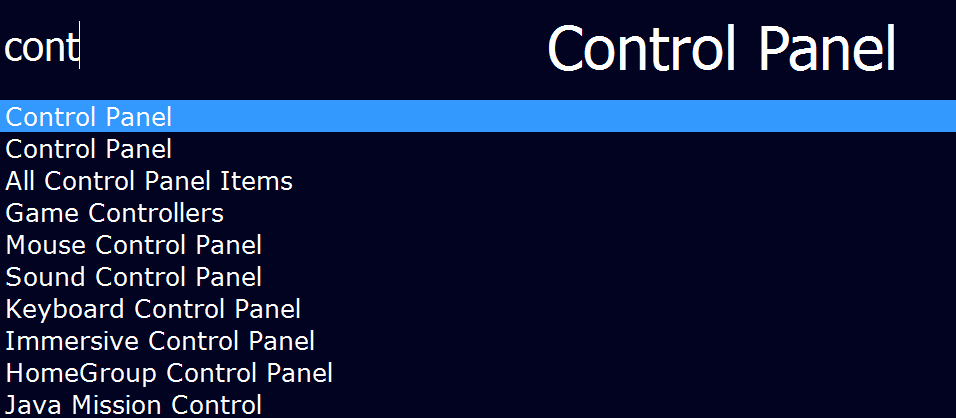
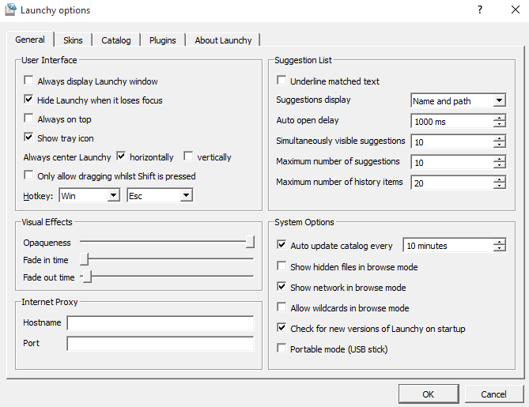

# SasPes Launchy Skin

Plain and simple skin for [Launchy](http://launchy.net/) with opportunity to become Enso Launcher like.

## Instalation
1. Download [launchy-skin](https://github.com/SasPes/launchy-skin/archive/master.zip) project
2. Unzip (extract) files from launchy-skin-master.zip
3. Copy SasPes folder to Launchy skin folder (Ex. C:\Program Files (x86)\Launchy\skins)
4. Go to Launchy => Options (Ctrl+,) => Skins tab => Select a skin => SasPes
5. Voilà

## Configuration
Go to Launchy => Options (Ctrl+,) => General  

